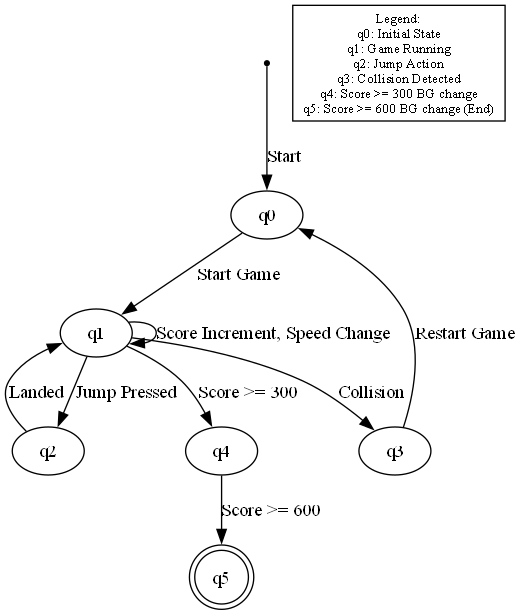
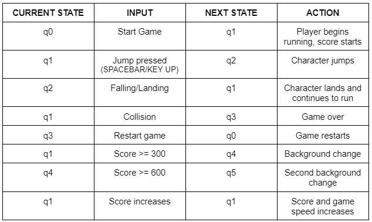
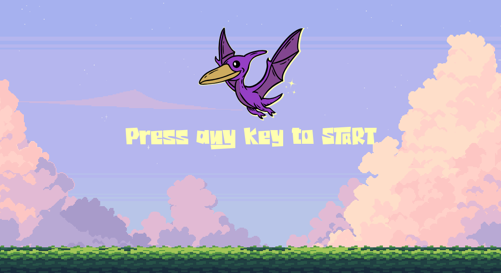

# Ptero Glide // Applications of Finite Automata
<div align = "center">
  
</div>
<br> Ptero Glide is a simple endless runner game where players control a pterodactyl gliding through a vibrant landscape. The objective is to dodge various obstacles, all while maintaining momentum and speed.
<br>
<div align = "center">
  <br>▰▰▰▰▰▰▰▰▰▰▰▰ this project is for  CS313 class Applications of Finite Automata ▰▰▰▰▰▰▰▰▰▰▰▰
</div>

## Table of Contents
1. [Project Description](#project-description)
2. [FSM Design](#fsm-design)
3. [Installation Guide](#installation-guide)
4. [Gameplay](#gameplay)
5. [Credits](#credits)

## Project Description
Ptero Glide is a simple endless runner game where players control a pterodactyl gliding through a vibrant landscape. Like the Chrome Dino game, which this game is inspired on. The objective is to achieve the highest score possible while navigating through various obstacles, all while maintaining momentum and speed. As the player progresses, the game introduces dynamic elements, including background changes based on score milestones (e.g., after reaching 300 and 600 points) that enhance the visual experience. Once the player reaches or adds up to a hundred points the speed of the game is multiplied, making it challenging and even more exciting. This project was built using Python's Pygame library.

## FSM Design
The FSM represents the game's states, showing how the game transitions between the menu, running, jumping, game over, and background changes as the player progresses. The DFA ensures the game is deterministic, with each state reacting to specific inputs. For example, the player can only transition from running to jumping with a jump input and can only restart the game after reaching the game over state.

<div align = "center">
  <br>╔══════════════════╗
  <br> <b> DFA VISUALIZATION </b>
  <br>╚══════════════════╝
  <br>  
  
</div>

<div align = "center">
  <br>╔══════════════════╗
  <br> <b> TRANSITION TABLE </b>
  <br>╚══════════════════╝
  <br>  
</div>

## Installation Guide
   Clone the repository:
   ```bash 
   git clone https://github.com/y4na/ptero-glide.git
   ```
  Activate the virtual environment:
   ```bash 
   .venv\Scripts\activate
  ```
  Install the required dependencies:
  ```bash 
   pip install pygame
  ```
  Run the game:
  ```bash 
   python main.py
  ```
## Gameplay
<div align = "center">
  
  ### SPACEBAR or UP ARROW KEY to jump <br>
  Full project demo: [Ptero Glide Gameplay](URL)
  ### ∘₊✧──────✧₊∘ UI SHOWCASE ∘₊✧──────✧₊∘
  ### Main Menu
   
  
  ### Main Background
  
 
  ### Background Change when score reaches 300
   
  
  ### Background Change when score reaches 600
   

  ### Game Over Screen
   
</div>

## Credits
<div align = "center">

  ### ∘₊✧──────✧₊∘ GRAPHIC ELEMENTS ∘₊✧──────✧₊∘
  [pterodactyl sprite](https://tonguesurgery.itch.io/tiny-dinosaur) <br>
  [backgrounds](https://craftpix.net/freebies/free-sky-with-clouds-background-pixel-art-set/) <br>
  [font](https://fontshub.pro/font/junglewood-download) <br>
  [tree obstacle](https://craftpix.net/freebies/free-tree-pixel-art-asset-pack/) <br>
  [rock obstacle](https://craftpix.net/freebies/free-rocks-pixel-art-asset-pack/) <br>

  ### ∘₊✧──────✧₊∘ SOUND EFFECTS and MUSIC ∘₊✧──────✧₊∘
  [jump & death sfx](https://www.sounds-resource.com/browser_games/googlechromedinosaurgame/sound/18002/) <br>
  [whoosh sfx](https://mixkit.co/free-sound-effects/whoosh/) <br>
  [background music](https://www.fesliyanstudios.com/royalty-free-music/download/8-bit-surf/568) <br>
  
  ### ∘₊✧──────✧₊∘ VIDEO TUTORIALS ∘₊✧──────✧₊∘
  [Parallax Background Scrolling by CodingWithRuss](https://www.youtube.com/watch?v=OAH8K5lVYOU) <br>
  [Pygame Tutorial by TechWithTim](https://www.youtube.com/watch?v=waY3LfJhQLY) <br>
  [Chrome Dino Game by Max Rohowsky](https://www.youtube.com/watch?v=KOBKkPWGP-g&list=PL30AETbxgR-fAbwiuU1vDl3owNUPUuVrz) <br>

  ### ∘₊✧──────✧₊∘ TOOLS and LIBRARIES  ∘₊✧──────✧₊∘
  [Install Python](https://www.python.org/downloads/) <br>
  [Pygame Library](https://www.pygame.org/) <br>
  [Graphviz Library Visualization Tool](https://graphviz.org/download/) <br>
  [Sprite Cutter](https://ezgif.com/sprite-cutter) <br>
</div>
